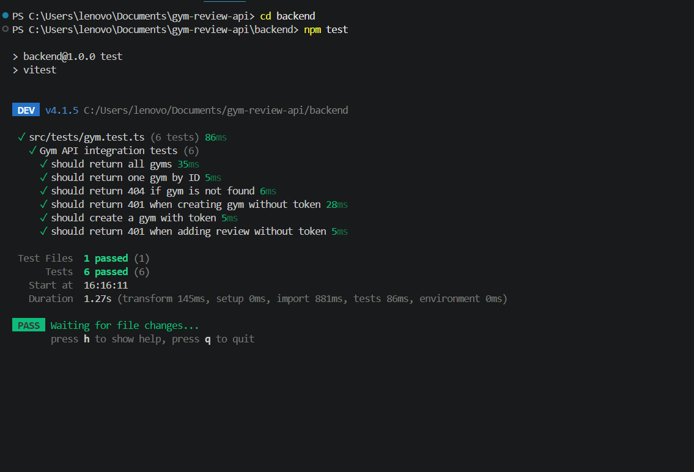
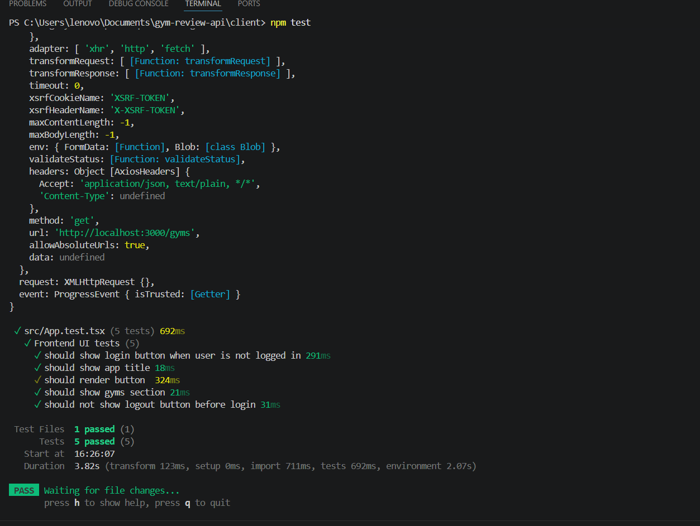
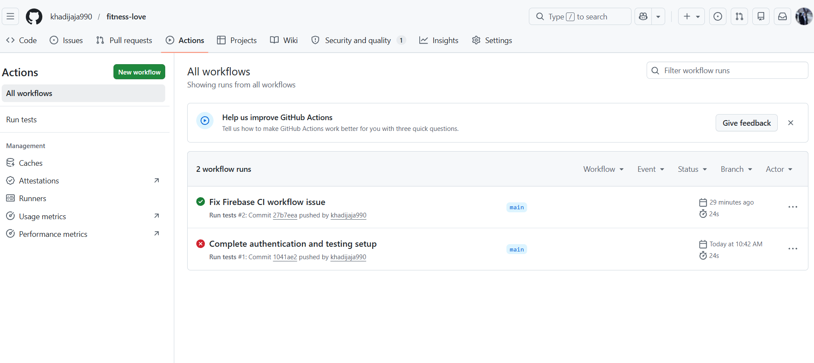

# Fitness Love

## Project Overview

Fitness Love is a full-stack Gym Review application where users can:

- View gyms
- Add gyms
- Write reviews
- Login with Google authentication

The project includes frontend testing, backend integration testing, Firebase authentication, and GitHub Actions CI pipeline.

---

## Technologies Used

### Frontend
- React
- TypeScript
- Vite
- Axios
- Firebase Authentication

### Backend
- Node.js
- Express
- TypeScript
- Firebase Admin SDK

### Testing
- Vitest
- Supertest
- Testing Library

---

## Project Structure

```bash
backend/
client/
.github/
README.md
```

---

## Setup Instructions

### Clone Repository

```bash
git clone https://github.com/khadijaja990/fitness-love.git
```

---

## Install Dependencies

### Backend

```bash
cd backend
npm install
```

### Frontend

```bash
cd client
npm install
```

---

## Environment Variables

Create a `.env` file inside the backend folder.

Example:

```env
PORT=3000

FIREBASE_PROJECT_ID=
FIREBASE_CLIENT_EMAIL=
FIREBASE_PRIVATE_KEY=

CLIENT_URL=http://localhost:5173
```

---

## Run the Project

### Start Backend

```bash
cd backend
npm run dev
```

### Start Frontend

```bash
cd client
npm run dev
```

---

## Testing

### Backend Integration Tests

Run backend tests:

```bash
cd backend
npm test
```

Tested features:
- GET /gyms
- GET /gyms/:id
- POST /gyms authentication
- Review protection
- Unauthorized access handling

---

### Frontend Unit Tests

Run frontend tests:

```bash
cd client
npm test
```

Tested features:
- Login button rendering
- App title rendering
- UI button rendering
- Gym section visibility
- Logout visibility before authentication

---

## Authentication

This project uses Firebase Authentication with Google Sign-In.

Authentication is implemented using:
- Firebase Authentication on the frontend
- Firebase Admin SDK on the backend
- Protected API routes with token verification middleware

Protected routes return:

```bash
401 Unauthorized
```

when users are not authenticated.

---

## Security Decisions

### Environment Variables

Sensitive values are stored in `.env` files and excluded from GitHub using `.gitignore`.

---

### Firebase Admin Credentials

The `serviceAccountKey.json` file is not committed to GitHub to protect Firebase admin credentials.

---

### Protected Routes

Protected routes use Firebase token verification middleware.

Unauthenticated users receive:

```bash
401 Unauthorized
```

---

### CORS Protection

CORS is configured to allow only the frontend origin instead of allowing all origins.

Example:

```bash
http://localhost:5173
```

---

### Token Security

Authentication tokens are verified securely using Firebase Admin SDK.

Tokens are not stored permanently in unsafe locations.

---

### GitHub Security

Sensitive credentials are not pushed to GitHub repositories or workflow files.

---

## Reflections

### Implementation Choices

We used:
- React and TypeScript for the frontend
- Express and Node.js for the backend
- Firebase Authentication for secure login
- Vitest for frontend and backend testing

Firebase was chosen because it provides simple and secure Google authentication integration.

---

### Challenges

Some challenges during development included:
- Managing Firebase authentication persistence
- Fixing GitHub Actions workflow issues
- Handling protected routes and token verification
- Writing frontend and backend tests

---

### Future Improvements

In the future, we would like to:
- Add a real database such as MongoDB or PostgreSQL
- Add user profile editing
- Improve gym review management
- Deploy the application online

---

## Screenshots

### Backend Tests



---

### Frontend Tests



---

### GitHub Actions



---